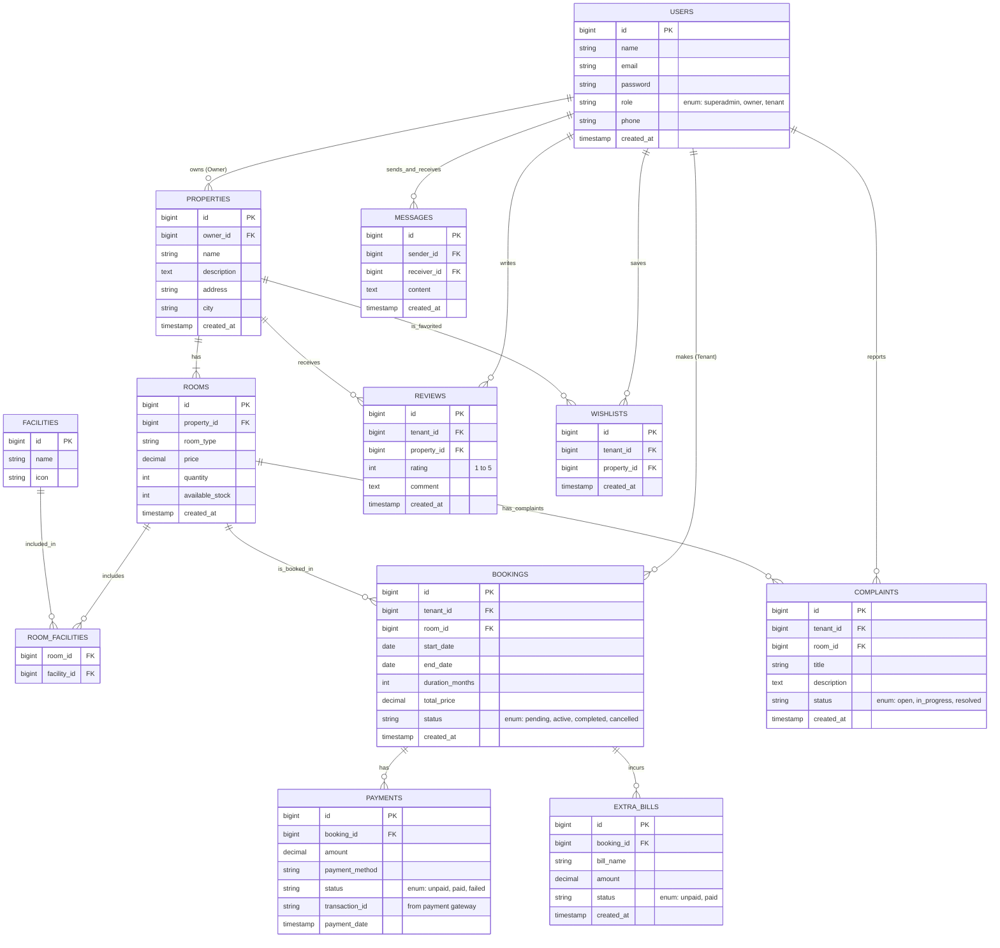

# Product Requirements Document (PRD)
**Project Name:** Sistem Manajemen dan Sewa Kos-Kosan (Property Rental Management System)
**Role:** Senior Product Manager & Tech Lead
**Date:** July 2026

---

## 1. Executive Summary
Aplikasi ini adalah platform sistem manajemen dan penyewaan properti, khususnya ditujukan untuk pengelolaan kos-kosan atau kontrakan. Sistem ini akan memfasilitasi tiga aktor utama: **Pencari Kos/Penyewa (Tenant)**, **Pemilik Kos (Owner/Landlord)**, dan **Administrator (Superadmin)**. Tujuannya adalah mendigitalisasi proses pencarian properti, pemesanan, pembayaran, serta manajemen operasional bagi pemilik kos.

---

## 2. Target Pengguna & Peran (User Roles)
1. **Tenant (Penyewa):** Pengguna yang mencari, memesan, dan membayar sewa kamar/properti.
2. **Owner (Pemilik Kos):** Pengguna yang mendaftarkan properti mereka, memanajemen kamar, melihat laporan pendapatan, dan mengelola penyewa.
3. **Superadmin (Admin):** Pengelola platform yang memonitor seluruh aktivitas, memverifikasi properti/owner, dan menangani komplain atau isu operasional platform.

---

## 3. Fitur Utama (Key Features)

### A. Tenant (Penyewa)
- **Registrasi & Profil:** Mendaftar akun dan melengkapi data diri (KTP, dll).
- **Pencarian Properti:** Mencari kos berdasarkan lokasi, harga, fasilitas, dan rating. Dilengkapi dengan **Pencarian Berbasis Peta (Geolocation)**.
- **Detail Properti:** Melihat foto, deskripsi, fasilitas lengkap, dan ulasan.
- **Pemesanan & Pembayaran (Booking & Payment):** Melakukan booking kamar (termasuk **Uang Jaminan/Deposit**) dan pembayaran terintegrasi (Payment Gateway).
- **Manajemen Sewa & Perpanjangan:** Melihat riwayat pembayaran, kontrak sewa aktif, tagihan tambahan bulanan, dan melakukan **Perpanjangan Sewa (Auto-Renewal)**.
- **Ulasan (Review):** Memberikan ulasan dan rating setelah masa sewa selesai atau berlangsung.
- **Chat In-App:** Berkomunikasi langsung dengan Owner dalam platform.

### B. Owner (Pemilik Kos)
- **Manajemen Properti:** Menambah, mengubah, dan menghapus data properti dan kamar (harga, stok, fasilitas).
- **Manajemen Pesanan:** Menerima atau menolak booking dari penyewa, serta memantau status pembayaran. Mengelola pencatatan pengembalian deposit.
- **Manajemen Tagihan Tambahan:** Membebankan biaya tambahan (seperti listrik, parkir) kepada Tenant bulanan.
- **Dashboard & Laporan:** Melihat statistik okupansi kamar, laporan pendapatan, dan analitik performa properti.
- **Manajemen Penghuni:** Melihat data penghuni aktif dan status tagihannya.
- **Chat In-App:** Merespons pertanyaan atau pesan dari Tenant secara langsung.

### C. Superadmin
- **Verifikasi:** Menyetujui pendaftaran owner baru dan verifikasi kelayakan properti.
- **Manajemen Pengguna (User Management):** Mengelola akun seluruh tenant dan owner.
- **Master Data:** Mengelola kategori kos, master fasilitas, dan pengaturan platform.
- **Laporan Keseluruhan:** Melihat transaksi global dan performa platform (komisi/revenue).

---

## 4. Skema Data & Arsitektur (Naratif)

### Arsitektur Sistem
Sistem akan dibangun menggunakan arsitektur *Monolithic* berbasis **Laravel** (sesuai *stack* yang sedang digunakan saat ini), atau *Modular Monolith*. 
- **Frontend/View:** Blade Templates dengan TailwindCSS/Bootstrap (NiceAdmin).
- **Backend:** Laravel Framework (PHP).
- **Database:** MySQL atau PostgreSQL.
- **Integrasi Pihak Ketiga:** Payment Gateway (Midtrans/Xendit) untuk pembayaran otomatis, dan layanan Cloud Storage/S3 untuk menyimpan gambar properti/KTP.

### Penjelasan Skema Data (Data Schema)
1. **Users:** Tabel sentral untuk autentikasi. Memiliki kolom `role` (superadmin, owner, tenant).
2. **Properties:** Menyimpan informasi kos (nama kos, alamat lengkap, deskripsi, ID owner). Satu owner bisa memiliki banyak properti (One-to-Many).
3. **Rooms:** Menyimpan informasi kamar di dalam properti (tipe kamar, harga, kapasitas, ketersediaan). Satu properti memiliki banyak tipe kamar (One-to-Many).
4. **Facilities:** Master data fasilitas (AC, WiFi, Kamar Mandi Dalam).
5. **Property_Facility / Room_Facility:** Tabel *pivot* (Many-to-Many) yang menghubungkan properti/kamar dengan ketersediaan fasilitas.
6. **Bookings (Transaksi):** Menyimpan data pemesanan kamar oleh tenant. Termasuk tanggal masuk, durasi sewa, total harga, dan status pesanan (pending, active, completed, cancelled).
7. **Payments:** Mencatat riwayat pembayaran dari sebuah *booking*. Berhubungan dengan integrasi Payment Gateway (status pembayaran: unpaid, paid, failed).
8. **Reviews:** Ulasan dan rating yang diberikan tenant terhadap properti.
9. **Complaints:** Mencatat laporan kerusakan atau keluhan dari tenant kepada owner terkait fasilitas kamar atau properti.
10. **Wishlists:** Menyimpan data properti yang difavoritkan oleh tenant untuk disimpan dan dilihat kembali di kemudian hari.
11. **Extra_Bills:** Mencatat tagihan tambahan (listrik, air, parkir) yang dibebankan kepada tenant di luar biaya sewa pokok.
12. **Messages (Chat):** Menyimpan histori percakapan internal antara Tenant dan Owner.

---

## 5. Visualisasi ERD (Entity Relationship Diagram)

Berikut adalah desain konseptual skema database sistem sewa properti menggunakan sintaks Mermaid:

---

## 6. Non-Functional Requirements (NFR)
1. **Keamanan (Security):** 
   - Implementasi autentikasi menggunakan Laravel Sanctum/Breeze.
   - Proteksi akses data (Owner A tidak boleh melihat properti Owner B).
   - Enkripsi password menggunakan Bcrypt.
2. **Kinerja (Performance):** 
   - Halaman daftar properti harus memuat dalam waktu < 2 detik.
   - Menggunakan *caching* (Redis/Memcached) untuk daftar properti yang sering dicari.
3. **Skalabilitas:** 
   - Desain database mendukung peningkatan jumlah properti dan transaksi secara eksponensial.
   - File gambar (foto kos) sebaiknya disimpan di Cloud Storage (seperti AWS S3) untuk meminimalisir beban server lokal.
4. **Reliabilitas:**
   - Database *backup* harian.

## 7. Fase Pengembangan (Roadmap)
- **Fase 1 (MVP - Minimum Viable Product):** 
  Autentikasi, CRUD Properti & Kamar oleh Owner, Pencarian Properti oleh Tenant, Manual Booking (Transfer Bank manual).
- **Fase 2:** 
  Integrasi Payment Gateway otomatis, Sistem Ulasan/Rating, Dashboard Owner (Statistik Okupansi).
- **Fase 3:** 
  Aplikasi Mobile (API), Notifikasi WhatsApp/Email Otomatis (Tagihan), Pencarian berbasis Peta (Google Maps API).

---
*Dokumen ini merupakan kerangka kerja dasar (baseline) dan akan diperbarui seiring dengan iterasi pengembangan produk.*
